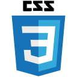
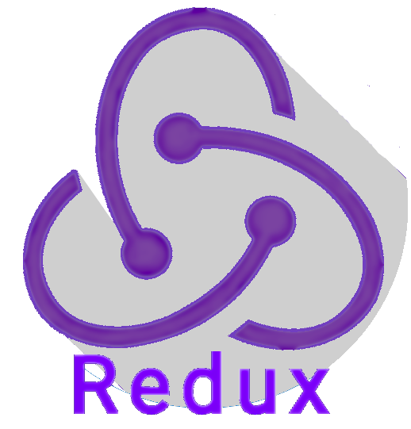
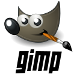
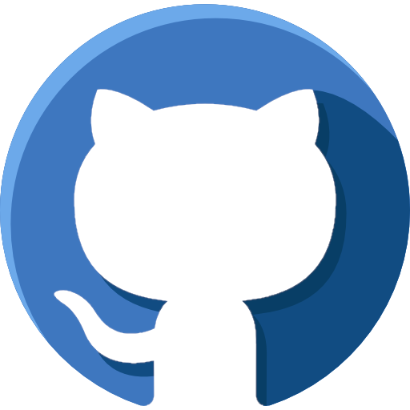

<!-- ------------Introdução------------ -->

  

    
Hi, I'm Luan Filipe.

    
  

  <h2>I'm a brazilian Full Stack Web Developer passionate about technology!</h2>

#

<!-- ------------Resumo Visual------------ -->

| Languages  | Technologies | Tools |  
|---|---|---|
|

|
&nbsp;&nbsp;&nbsp;&nbsp;&nbsp;&nbsp;&nbsp;&nbsp;&nbsp;&nbsp;&nbsp;&nbsp;&nbsp;&nbsp;&nbsp;&nbsp;&nbsp;&nbsp;&nbsp;&nbsp;
|
&nbsp;&nbsp;&nbsp;&nbsp;&nbsp;&nbsp;&nbsp;&nbsp;&nbsp;&nbsp;
|

#

<!-- ------------Habilidates Tecnicas------------ -->

  

	  
My Technical Skills:

    
  

| Languages  | Frameworks | Technologies | Tools | 
|---|---|---|---|
|
JavaScript🔸SQL
|
React🔸Jest
|
Git🔸React Testing Library🔸API🔸HTML🔸CSS🔸React Router🔸Redux🔸Context API🔸React Hooks🔸Docker🔸Docker Compose🔸Local Storage🔸Mocks🔸Bootstrap
|
Linux🔸Terminal🔸Bash🔸GitHub🔸Visual Studio Code🔸MySQL Workbench
|

#

<!-- ------------Status do Github------------ -->

  
  

#

<!-- ------------Habilidades Pessoais/Soft Skills------------ -->

	

	  
My Soft Skills:

	  
	

	<h4 align="center">
	  Ethic, Resilience, Collaboration, Non-Agressive Communication, Creativity, Time Management, Active listening, Argumentation
	</h4>
	

	  I like to deal with people and understand their motivations,
	  develop lasting solutions to problems, find ways to optimize and automate processes,
	  give a beautiful aesthetic to what I produce and one of my greatest satisfactions 
	  is fixing and improving things.
	

#

<!-- ------------Informações de Contato------------ -->

Connect with me:

  
  
   

# 
<!-- ------------Visualizações e Seguidores------------ -->

❤ Views and Followers

	
	

 

<!-- ------------Palavras-Chave Para Motores de Busca------------ -->

<!-- programação | desenvolvimento | development | dev | webdeveloper| webdev| html | css | javascript | JS | python | py | Typescript | ts | Linux | react | redux | context | contextApi | docker | docker-compose | sql | mysql | nodeJS | frontend | backend | fullstack | bilingual | home office | stackoverflow | jest | RTL | mocha | sinnon | chai | . -->
