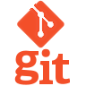
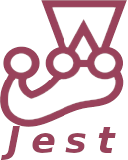
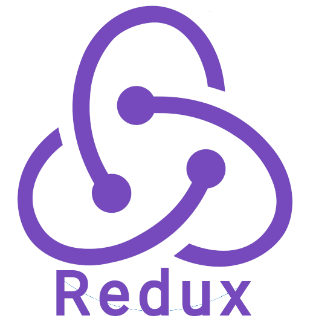
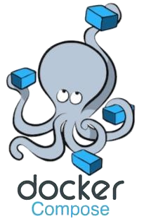
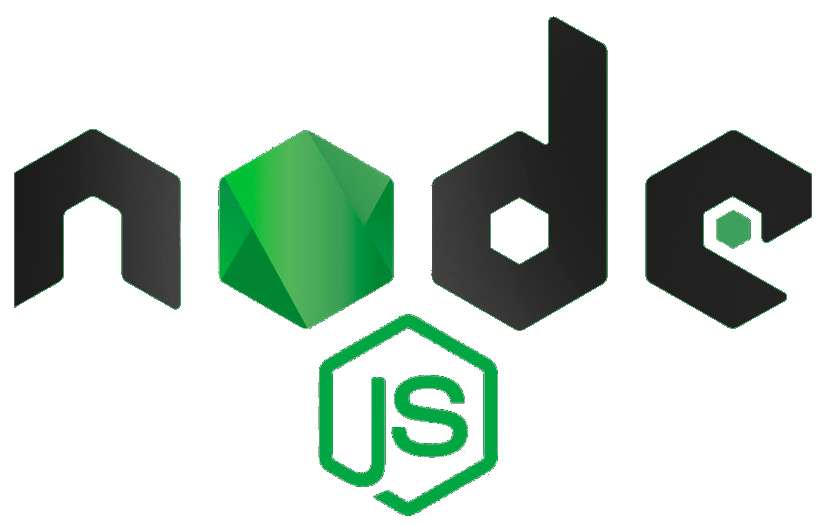
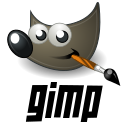

<h1 align="center">
Hi, I'm Luan Filipe.

</h1>

<h2 align="center">I'm a brazilian Full Stack Web Developer passionate about technology!</h2>

##

| Languages  | Technologies | Tools |  
|---|---|---|
|

|
&nbsp;&nbsp;&nbsp;&nbsp;&nbsp;&nbsp;&nbsp;&nbsp;&nbsp;&nbsp;&nbsp;&nbsp;&nbsp;&nbsp;&nbsp;&nbsp;&nbsp;&nbsp;&nbsp;&nbsp;
|
&nbsp;&nbsp;&nbsp;&nbsp;&nbsp;&nbsp;&nbsp;&nbsp;&nbsp;&nbsp;
|

  

    

	<h4 align="center">My Technical Skills
	
	</h4>
	

| Languages  | Frameworks | Technologies | Tools | 
|---|---|---|---|
|
JavaScript🔸SQL
|
React🔸Jest
|
Git🔸React Testing Library🔸API🔸HTML🔸CSS🔸React Router🔸Redux🔸Context API🔸React Hooks🔸Docker🔸Docker Compose🔸Local Storage🔸Mocks🔸Bootstrap
|
Linux🔸Terminal🔸Bash🔸GitHub🔸Visual Studio Code🔸MySQL Workbench
|
  

## 

  
  

## 

	<h2 align="center">
		My Soft Skills
		
	<h2>
	<h4 align="center">Ethic, Resilience, Collaboration, Non-Agressive Communication, Creativity, Time Management, Active listening, Argumentation<h4>
	I like to deal with people and understand their motivations, develop lasting solutions to problems, find ways to optimize and automate processes, give a beautiful aesthetic to what I produce and one of my greatest satisfactions is fixing and improving things.

## Connect with me:

  
  
   

## ❤ Views and Followers

	
	

 

<!-- programação | desenvolvimento | development | dev | webdeveloper| webdev| html | css | javascript | JS | python | py | Typescript | ts | Linux | react | redux | context | contextApi | docker | docker-compose | sql | mysql | nodeJS | frontend | backend | fullstack | bilingual | home office | stackoverflow | jest | RTL | mocha | sinnon | chai | . -->
